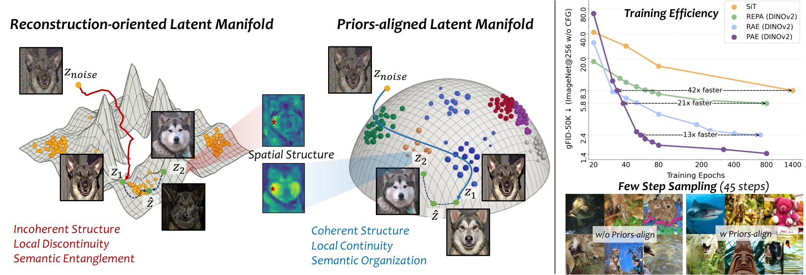
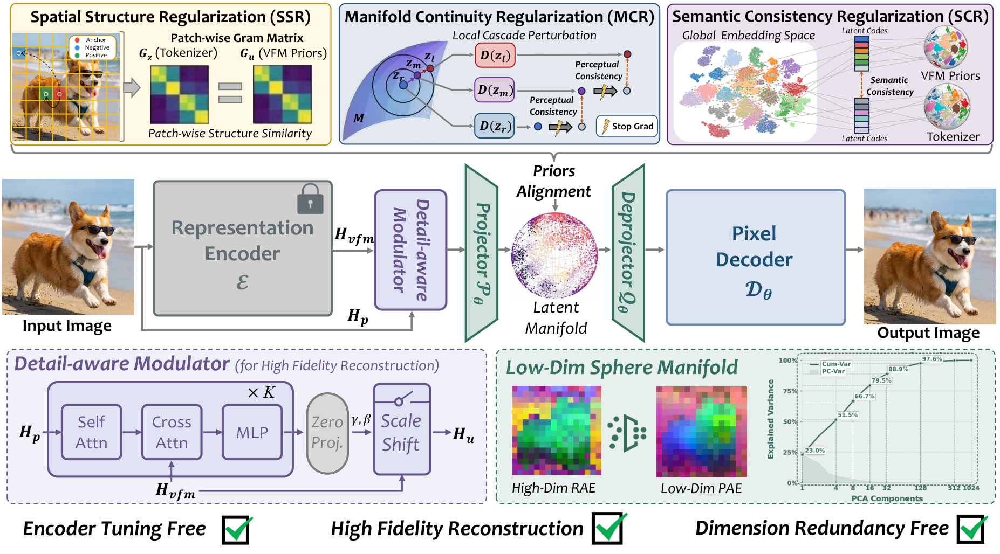

<h1>What Matters for Diffusion-Friendly Latent Manifold? Prior-Aligned Autoencoders for Latent Diffusion</h1>

This project presents **PAE** (Prior-Aligned AutoEncoder), a tokenizer framework that explicitly shapes a **diffusion-friendly latent manifold** for latent diffusion models. Instead of relying solely on reconstruction fidelity or passively inheriting pretrained representations, PAE identifies and optimizes three key properties of a diffusion-friendly latent space — **spatial structure coherence**, **local manifold continuity**, and **global manifold semantics** — through targeted prior-alignment regularizations. On ImageNet 256×256, PAE achieves a new **state-of-the-art gFID of 1.03** with up to **13× faster convergence** than RAE under the same LightningDiT setup.   

  
   
  <em>
  Prior alignment constructs a diffusion-friendly latent manifold. Left: Compared with reconstruction-oriented counterparts, the prior-aligned latent manifold is more structurally coherent, locally continuous, and semantically organized. Right: PAE yields faster convergence, better generation quality, and robust few-step sampling performance.</em>

  
   
  <em>Class-conditional samples generated by PAE with LightningDiT-XL/1 on ImageNet 256×256.</em>

## 🔥 Updates

* **[2026.05.09]** 🚀 🚀 🚀 We release **PAE**. Code and pretrained models are now available!

## ✨ Highlights

- 🎯 **New Perspective**: We study what makes a latent manifold diffusion-friendly, identifying three key properties: spatial structure coherence, local manifold continuity, and global manifold semantics.
- 🏗️ **Explicit Manifold Shaping**: PAE turns these properties into explicit training objectives via three prior-alignment regularizations (SSR, MCR, SCR), rather than leaving them to emerge indirectly.
- ⚡ **13× Faster Convergence**: PAE reaches performance comparable to RAE with up to 13× fewer training epochs under the same LightningDiT setup.
- 🏆 **State-of-the-Art**: Achieves gFID **1.03** on ImageNet 256×256, the best result among all compared methods.
- 🔄 **Encoder-Agnostic**: Compatible with multiple VFM backbones including DINOv2, SigLIP2, DINOv3, and MAE.

## 🏛️ Architecture

  
   
  <em>Overview of the PAE framework. A frozen VFM provides stable representation features. DAM injects pixel detail while preserving the VFM as the dominant semantic source. Three prior-alignment objectives explicitly shape the latent manifold.</em>

## ❤️ Acknowledgement
Our work builds upon the foundations laid by many excellent projects in the field. We would like to thank the authors of [LightningDiT](https://github.com/hustvl/LightningDiT), [RAE](https://github.com/bytetriper/RAE), [GAE](https://github.com/sii-research/GAE), [ADM](https://github.com/openai/guided-diffusion). We are grateful for their contributions to the community.

## ✨ Star History

<a href="https://www.star-history.com/?repos=ZhengrongYue%2FPAE&type=date&legend=top-left">
 <picture>
   <source media="(prefers-color-scheme: dark)" srcset="https://api.star-history.com/chart?repos=ZhengrongYue/PAE&type=date&theme=dark&legend=top-left" />
   <source media="(prefers-color-scheme: light)" srcset="https://api.star-history.com/chart?repos=ZhengrongYue/PAE&type=date&legend=top-left" />
   
 </picture>
</a>
